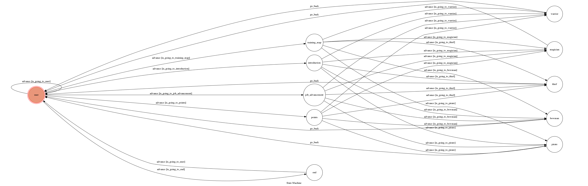

# MapleStoryBot

A telegram bot based on a finite state machine.

## Finite State Machine

## Usage
* Type `/start` to begin conversation

* First, choose which information to get
    * Introduction
    * AP/SP
    * Job Advancement
    * Training Map

* Second, choose one of the following character
    * Warrior
    * Magician
    * Bowman
    * Thief
    * Pirate

* Type `/end` to finish conversation

## Author
[LinYC](https://github.com/F74042060)
